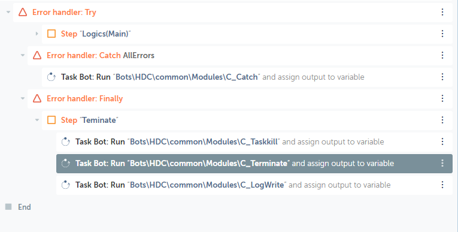

# C_BackupToNAS #

> Maintask 수행 후, Terminate Phase에서 네트워크 드라이브로 작업데이터 백업

  

# Index #
- [C_BackupToNAS](#c_backuptonas)
- [Index](#index)
- [Remarks](#remarks)
- [Example](#example)
- [Dependency](#dependency)

 

# Remarks #
- Creator 및 Runner에서 네트워크 드라이브 사전설정 필요

  

# Example #

  

# Dependency #
- app.settings.xml
- configuration.xml
- [common\Modules\C_LogWrite](./C_LogWrite.html)
