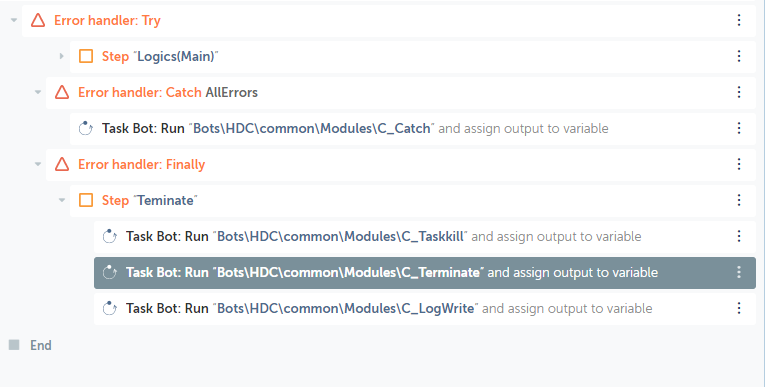

# C_InitializeProcess #

> Maintask 및 Subtask 실행에 필요한 환경설정, 변수생성 및 초기화 작업

<br/>

1. 작업폴더 초기화
2. app.settings.xml 생성
3. configuration.xml 생성
<br/><br/>

# Index #
- [C_InitializeProcess](#c_initializeprocess)
- [Index](#index)
- [Syntax](#syntax)
- [Parameters](#parameters)
- [Return value](#return-value)
- [Remarks](#remarks)
- [Example](#example)
- [Dependency](#dependency)


<br/>

# Syntax #

<br/>
<br/>
<br/>

# Parameters #

Name | Required/Optional | Data Type | Description | 
-- | -- | -- | -- |
| sAATaskname | Required | String | Maintask Fullname($System:AATaskname$ 을 변수로 받음) |

<br/><br/><br/>

# Return value #
Name | Data Type | Description | Example |
-- | -- | -- | -- |
| sBusiness | String | 부서코드 (Maintask파일의 1단계 상위 폴더이름) | NL02 |
| sCompany | String | 법인명 (Maintask파일의 2단계 상위 폴더이름) | HDC |
| sMaintask | String | Maintask 이름 | R202012-003_Maintask01 |
| sPathAppdata | String | 템플릿 사용에 필요한 설정파일들(app.settings.xml)을 저장하기 위한 폴더 경로 | C:\Users\Connor\AppData\Roaming\Automation Anywhere |
| sPathConfig | String | 시나리오의 Configuration.xml 파일 경로 | X:\RPA_NAS\HDC\Department\Code_Name\Shared Data\configuration.xml |
| sPathGlobalSetting | String | 전체 시나리오를 대상으로한 Config 파일 | X:\RPA_NAS\HDC\.Settings\app.global.settings.xml |
| sPathInput | String | 시나리오 작업폴더 (Input) | C:\RPA_Working\HDC\Department\Code_Name\Input |
| sPathLog | String | 시나리오 작업폴더 (Log) | C:\RPA_Working\HDC\Department\Code_Name\Log |
| sPathNAS | String | 네트워크 폴더 저장소 | X:\RPA_NAS\HDC\Department\Code_Name |
| sPathNASData | String | 네트워크 폴더 저장소(백업데이터 저장폴더) | c:\RPA_NAS\HDC\Department\Code_Name\Data |
| sPathNasDocs | String | Description | Example |
| sPathOutput | String | 시나리오 작업폴더 (Output) | C:\RPA_Working\HDC\Department\Code_Name\Output |
| sPathRootDocs | String | **시나리오 작업폴더 Root** | **c:\RPA_Working** |
| sPathRootNAS | String | **네트워크 폴더 저장소 Root**| **x:\RPA_NAS** |
| sPathScenario | String | 시나리오 작업폴더경로(Fullpath) | c:\RPA_Working\HDC\Department\Code_Name |
| sPathScreenshot | String | 시나리오 작업폴더 (Screenshot) | C:\RPA_Working\HDC\Department\Code_Name\Screenshot |
| sPathShared | String | 네트워크 폴더 저장소(Shared Data) | c:\RPA_NAS\HDC\Department\Code_Name\Shared Data |
| sPathSystemConfig | String | 템플릿 설정파일 | C:\Users\Connor\AppData\Roaming\Automation Anywhere/app.settings.xml |
| sPathTemp | String | 시나리오 작업폴더 (Temp) | C:\RPA_Working\HDC\Department\Code_Name\Temp |
| sPathTemplate | String | 시나리오 작업폴더 (Template) | C:\RPA_Working\HDC\Department\Code_Name\Template |
| sScenario | String | 시나리오코드_시나리오이름 | R202012-003_Production Report |
| sScenarioCode | String | 시나리오 코드 | R202012-003 |
| sScenarioName | String | 시나리오 이름 | Production Report |
<br/><br/>

# Remarks #
- Local 저장소 및 네트워크 저장소 경로 변경 시, C_Initialize의 **sPathRootDocs**, **sPathRootNAS** 재정의 필요
- `Subtask에서 사용불가`

<br/><br/>


# Example #


<br/><br/>

# Dependency #


```
eeu
oeu
oe
u
```
- [ ] uu


