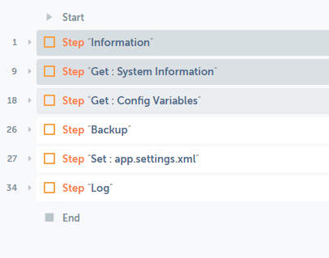

# C_Terminate #

> 메인 프로세스 Terminate Phase

 

1. 네트워크 드라이브로 작업파일 백업
2. 종료 로그 기록
3. 종료 이메일 Send(Optional)
   
 

# Index #
- [C_Terminate](#c_terminate)
- [Index](#index)
- [Parameters](#parameters)
- [Remarks](#remarks)
- [Example](#example)
- [Dependency](#dependency)

 

# Parameters #

Name | Required/Optional | Data Type | Description | 
-- | -- | -- | -- |
| sAATaskname | Required | String | Maintask Fullname($System:AATaskname$ 을 변수로 받음) |

 

# Remarks #
- 

  

# Example #

  

# Dependency #
- app.settings.xml
- configuration.xml
- [common\Modules\C_LogWrite](./C_LogWrite.html)
- [common\Modules\C_BackupToNAS](./C_BackupToNAS.html)
  
