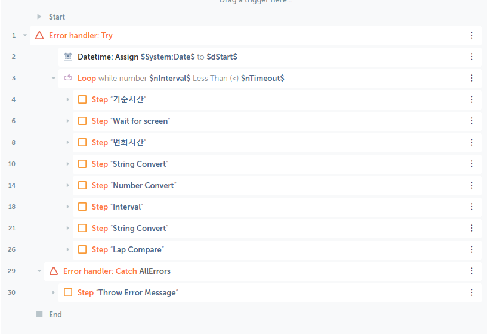
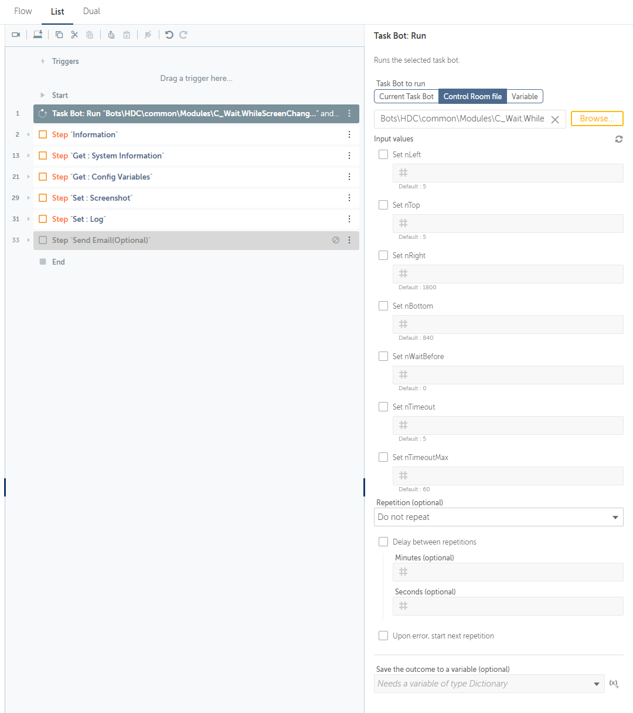

# C_Wait.WhileScreenChanging #

> 지정된 화면 범위에서 화면 변화가 멈출때까지 대기(Wait)  

 

# Index #
- [C_Wait.WhileScreenChanging](#c_waitwhilescreenchanging)
- [Index](#index)
- [Parameters](#parameters)
- [Example](#example)
- [Dependency](#dependency)

 
 

# Parameters #

Name | Required/Optional | Data Type | Default | Description | Example
-- | -- | -- | -- | -- | -- |
| nBottom | Optional | Number | 840 | 화면좌표(Bottom) | 
| nLeft | Optional | Number | 5 | 화면좌표(Left) | 
| nRight | Optional | Number | 1800 | 화면좌표(Right) | 
| nTimeout | Optional | Number | 5 | nTimeout 동안 화면변화가 없을 시 Loop Break, 다음 코드진행 | 
| nTimeoutMax | Optional | Number | 60 | 최대 대기시간 | 
| nTop | Optional | Number | 5 | 화면좌표(Top) | 
| nWaitBefore | Optional | Number | 0 | 프로세스 시작 전 사전딜레이 | 
 

 

# Example #
> Code
> 

> Code

  

# Dependency #
